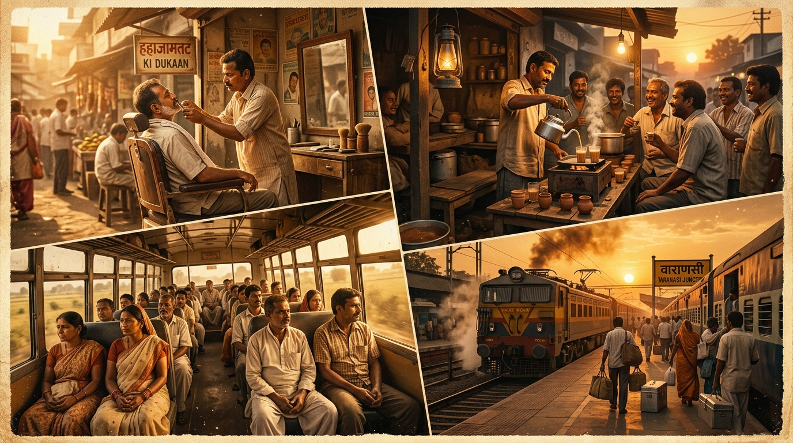
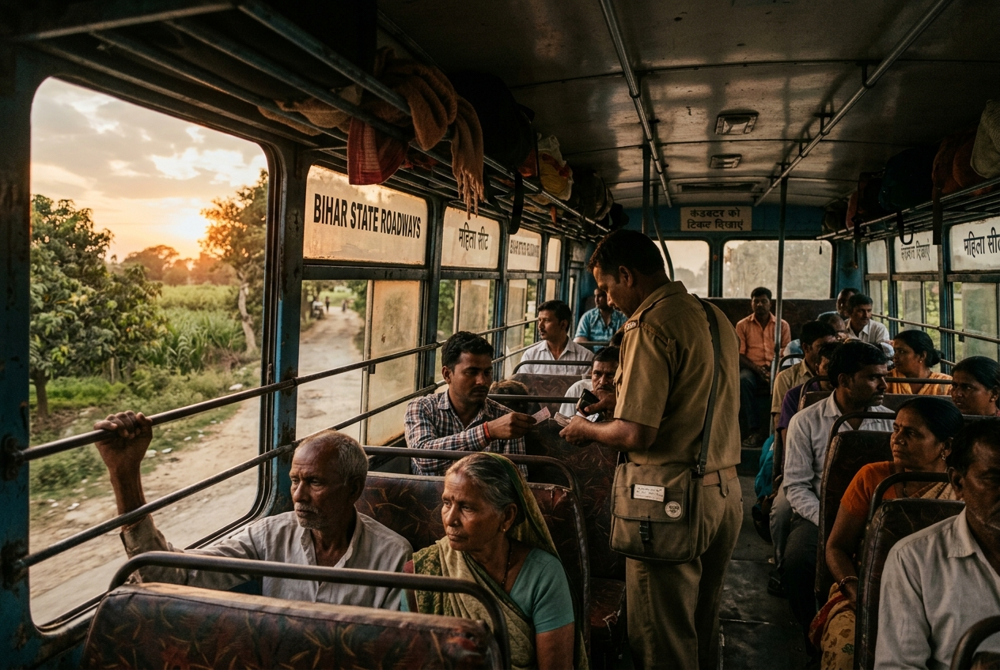
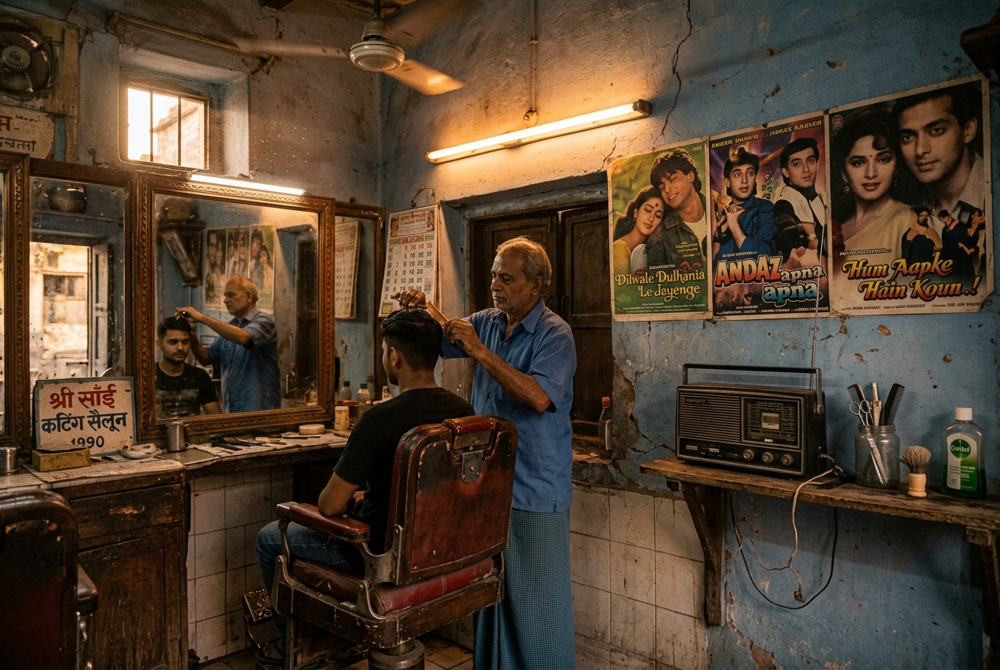
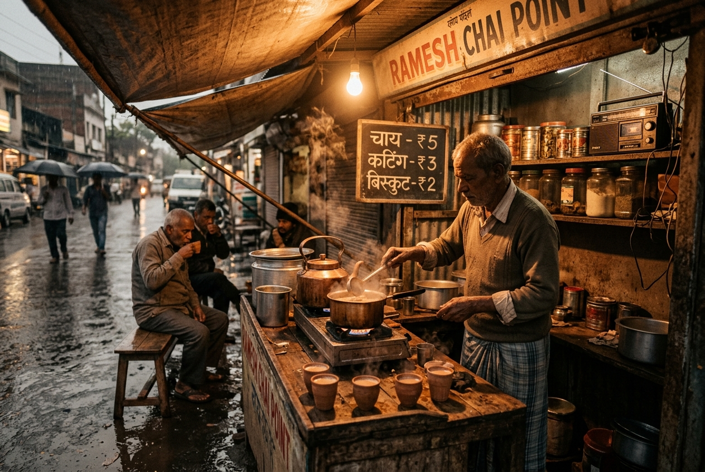
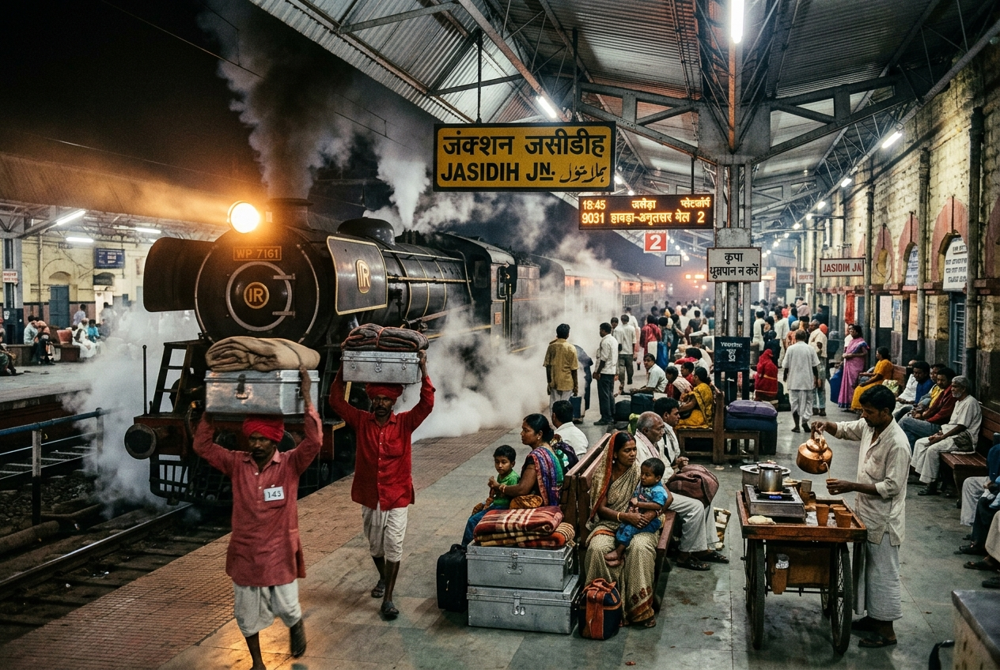
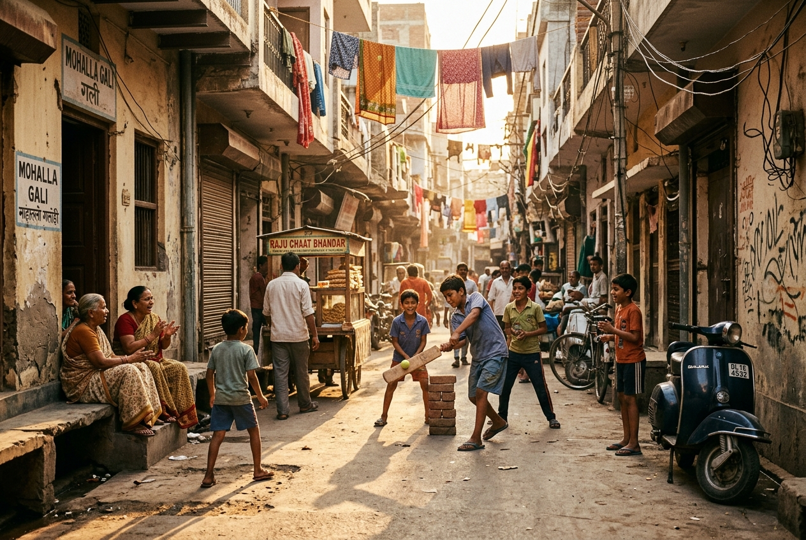
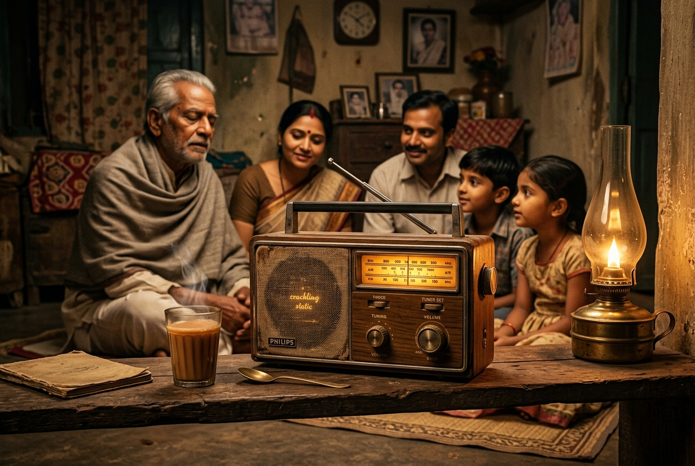

<div align="center">

# 📻 Yaadon Ki Duniya (यादों की दुनिया)
### 🌟 *A Premium Retro Nostalgic Ambient Audio & Music Experience*

[](https://indrajitkumar23541-a11y.github.io/Yaadon_Ki_Duniya/)
[](https://github.com/indrajitkumar23541-a11y/Yaadon_Ki_Duniya/actions)
[](https://reactjs.org/)
[](https://www.typescriptlang.org/)
[](https://vitejs.org/)
[](LICENSE)

<br />

### 🔗 **[👉 Click Here to Experience Yaadon Ki Duniya Live (https://indrajitkumar23541-a11y.github.io/Yaadon_Ki_Duniya/)](https://indrajitkumar23541-a11y.github.io/Yaadon_Ki_Duniya/)**

<br />



<br />

**Yaadon Ki Duniya** is an immersive, high-aesthetic web application designed to transport you back into the golden era of 90s & 2000s India. Featuring **6 distinct ambient retro environments**, **700+ handpicked embeddable superhit songs** (Bollywood Classics + Desi Bhojpuri Flashback Gold), a dynamic **2:1 Interleaved Radio Engine**, real-time background soundscapes, web audio synthesizers, interactive 90s chitthi/postcard generator, and continuous audio playback.

</div>

---

## 📋 Table of Contents
- [🌐 Live Website Link](#-live-website-link)
- [✨ Key Features](#-key-features)
- [🎛️ Interactive Modules](#️-interactive-modules)
- [🧠 2:1 Interleaved Radio Algorithm](#-21-interleaved-radio-algorithm)
- [🖼️ Nostalgic Environments & Scenes](#-nostalgic-environments--scenes)
- [🎶 Curated Music Dataset](#-curated-music-dataset)
- [🛠️ Tech Stack & Architecture](#️-tech-stack--architecture)
- [🚀 Local Setup & Installation](#-local-setup--installation)
- [📜 License](#-license)

---

## 🌐 Live Website Link

Check out the live interactive website deployed directly on GitHub Pages:

👉 **[https://indrajitkumar23541-a11y.github.io/Yaadon_Ki_Duniya/](https://indrajitkumar23541-a11y.github.io/Yaadon_Ki_Duniya/)**

*(Compatible with both Desktop and Mobile browsers)*

---

## ✨ Key Features

### 🌌 100% Transparent Glassmorphic Design
- **Ultra-Modern Transparent Navbar**: Floating glass header with zero visual occlusion over high-definition cinematic background artwork.
- **Micro-Animations & Visual Feedback**: Dynamic `brandPulse` logo glow, smooth `heroSlideUp` entrances, 3D card tilt breathing, and glowing active badges.
- **Cinematic Atmosphere Switcher**: Toggle real-time lighting modes — **Daylight Sunshine** (☀️), **Sunset Hour** (🌇), **Moonlight Stars** (🌙), and **Rainy Glass Drops** (🌧️).

### 📻 Retro Audio Engine & Soundscapes
- **Vintage Radio Tuner Dial (88.5 FM — 107.9 FM)**: Interactive frequency dial complete with tuning knob, station lock indicator, and real MW/FM static noise sweep.
- **Animated Cassette Deck View**: Real-time rotating magnetic tape spools, animated ribbon, and vintage Side A / Side B LED status indicators.
- **Dual Audio Layering**: Simultaneous playback of realistic background environment MP3 loops (bus horns, rain on tin roof, scissors snip, railway announcements) mixed seamlessly with active YouTube music streams.

---

## 🎛️ Interactive Modules

| Feature | Description | Sound / Visual Effect |
|---|---|---|
| 📻 **Radio FM Tuner** | Dial frequencies between 88.5 FM and 107.9 FM | Authentic analog static sweep & station locking |
| 🫖 **Desi Sound Board** | Instant Web Audio API synthesizers | Bus Horn (🎺), Barber Scissors (✂️), Kulhad Chai (🫖), Train Whistle (🚂) |
| 💌 **90s Postcard / Chitthi** | Generate personalized handwritten retro postcards | Custom postmarks, postal stamps & one-click social share |
| 🎭 **Mood & Vibe Filter** | Filter 700+ songs by mood | Romantic, Travel Roadtrip, High-Energy Masti, Birha & Pehla Nasha |
| 🪕 **Bhojpuri Flashback Gold** | Integrated 100+ nostalgic 90s/2000s classics | Manoj Tiwari, Radhe Shyam Rasiya, Sharda Sinha, Kalpana Patowary |

---

## 🧠 2:1 Interleaved Radio Algorithm

The engine balances 90s/2000s Bollywood Nostalgia with Desi Bhojpuri Hits throughout continuous playback:

$$\text{Playback Sequence: } [\text{Bollywood}_1, \text{Bollywood}_2, \text{Bhojpuri}_1, \text{Bollywood}_3, \text{Bollywood}_4, \text{Bhojpuri}_2, \dots]$$

### How It Works:
1. **Metadata Classification**: Each track is dynamically tagged (`category: 'bollywood'` or `'bhojpuri'`) in the catalog.
2. **Interleaved Queue Generation**: The algorithm splits playlist pools into dual buckets and generates an alternating $2:1$ queue pattern.
3. **Seamless Fallback**: If a stream is unavailable or restricted, the smart fallback system transitions instantly to the next track without breaking the playback flow.

---

## 🖼️ Nostalgic Environments & Scenes

<div align="center">

| 🚌 Bus Ka Safar (बस का सफ़र) | ✂️ Desi Salon (देसी सैलून) |
|:---:|:---:|
|  |  |
| *Patna to Nawada Local Bus — Horns, conductor calls & roadtrip anthems.* | *Barber Shop — Scissors snip, clipper buzz & 90s cassette hits.* |

<br />

| ☕ Chai Tapri (चाय की टपरी) | 🚂 Railway Station (रेलवे स्टेशन) |
|:---:|:---:|
|  |  |
| *Rainy Tea Stall — Sizzling kettle, kulhad chai & soulful melodies.* | *Platform 1 — Chai-garam calls, distant train whistles & journey ballads.* |

<br />

| 🌇 Mohalle Ki Shaam (मोहल्ले की शाम) | 📻 Purana Radio (पुराना रेडियो) |
|:---:|:---:|
|  |  |
| *Sunset Rooftop Hangout — Neighborhood chatter & nostalgic dusk hits.* | *Binaca Geetmala Era — Vintage MW/FM radio static & golden classics.* |

</div>

---

## 🎶 Curated Music Dataset

Over **700+ handpicked tracks** cataloged with metadata, high-resolution artwork, and embeddable YouTube video streams:

| Scene | Environment Vibe | Curated Artists & Soundtracks | Total Pool |
|---|---|---|---|
| 🚌 **Bus Ka Safar** | Roadtrip & Highway Nostalgia | DDLJ, Pardes, Dil Se, Swades, Jab We Met + Gayatri Rani, Manoj Tiwari | **120+ Tracks** |
| ✂️ **Desi Salon** | Barber Shop Cassette Deck | Baazigar, Main Khiladi Tu Anari, Coolie No.1 + Radhe Shyam Rasiya | **120+ Tracks** |
| ☕ **Chai Tapri** | Rain & Monsoon Romance | Aashiqui, Saajan, Dil Chahta Hai, Tere Naam + Kalpana Patowary, Folk Hits | **120+ Tracks** |
| 🚂 **Railway Station** | Platform Memories & Journey | Parichay, Dost, Highway, Rockstar + Sharda Sinha, Sunil Chhaila Bihari | **120+ Tracks** |
| 🌇 **Mohalle Ki Shaam** | Evening Rooftop & Dusk Vibes | QSQT, Darr, Dhadkan, RHTDM + Khesari Lal, Pawan Singh, Chhath Songs | **120+ Tracks** |
| 📻 **Purana Radio** | Binaca Geetmala Chartbusters | Sadak, Taal, Khalnayak, Aashiqui + Vintage Radio Audio Renditions | **120+ Tracks** |

---

## 🛠️ Tech Stack & Architecture

- **Frontend Core**: [React 18](https://reactjs.org/) + [TypeScript 5](https://www.typescriptlang.org/)
- **Bundler & Dev Server**: [Vite 5](https://vitejs.org/)
- **Audio Synthesizer**: Web Audio API (`AudioContext`, `OscillatorNode`, `BiquadFilterNode`)
- **Streaming API**: Window `YT.Player` iFrame API with event-driven state control
- **CI/CD Deployment**: Automated GitHub Actions Workflow (`.github/workflows/deploy.yml`)

```
Yaadon_Ki_Duniya/
├── .github/workflows/
│   └── deploy.yml       # Automated Vite Build & GitHub Pages Deployment
├── public/
│   ├── audio/           # Environmental background ambient MP3 audio loops
│   └── images/          # High-resolution HD artwork and scene banners
├── src/
│   ├── components/
│   │   ├── Player.tsx          # Custom Player with 2:1 Interleaved Mode
│   │   ├── RadioTuner.tsx      # Interactive 88.5-107.9 FM Radio Dial
│   │   ├── SoundBoard.tsx      # Web Audio Synthesizer Sound Board
│   │   ├── MoodFilter.tsx      # Vibe & Mood Selector Component
│   │   ├── PostcardModal.tsx   # 90s Handwritten Chitthi Generator
│   │   └── WeatherOverlay.tsx  # Dynamic Lighting & Atmosphere Switcher
│   ├── utils/
│   │   └── soundEffects.ts     # Pure Web Audio Synth Sound FX Engines
│   ├── App.tsx                 # Main Application State & Scene Manager
│   ├── data.ts                 # 700+ Song Catalog & Interleaving Engine
│   └── styles.css              # Design System & Token Utilities
├── index.html                  # HTML Shell & Devanagari Fonts
├── vite.config.ts              # Vite Config with GitHub Pages Base Path
└── package.json                # Project Dependencies & Build Scripts
```

---

## 🚀 Local Setup & Installation

### Prerequisites
- Node.js (v18.x or higher)
- npm or yarn

### Steps to Run Locally

1. **Clone the repository:**
   ```bash
   git clone https://github.com/indrajitkumar23541-a11y/Yaadon_Ki_Duniya.git
   cd Yaadon_Ki_Duniya
   ```

2. **Install dependencies:**
   ```bash
   npm install
   ```

3. **Start local development server:**
   ```bash
   npm run dev
   ```
   Open `http://localhost:5173` in your browser.

4. **Create production build:**
   ```bash
   npm run build
   ```

---

## 📜 License

Distributed under the **MIT License**. See [`LICENSE`](LICENSE) for more information.

<div align="center">

<br />

**[👉 Launch Yaadon Ki Duniya App Live](https://indrajitkumar23541-a11y.github.io/Yaadon_Ki_Duniya/)**

<sub>Created with ❤️ for retro 90s nostalgia and timeless Indian melodies.</sub>

</div>
